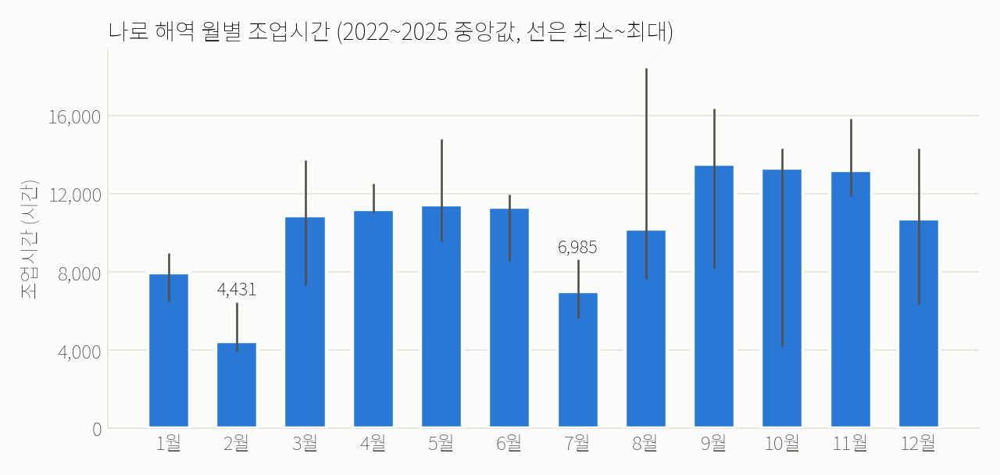
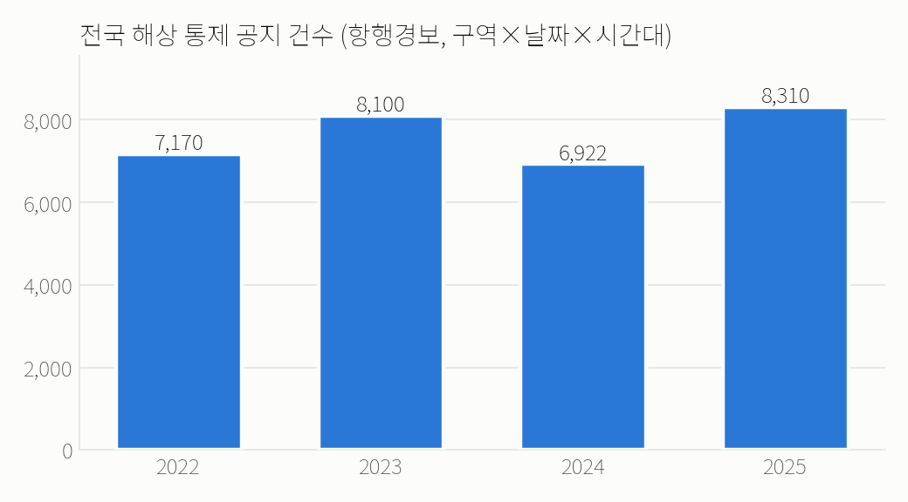
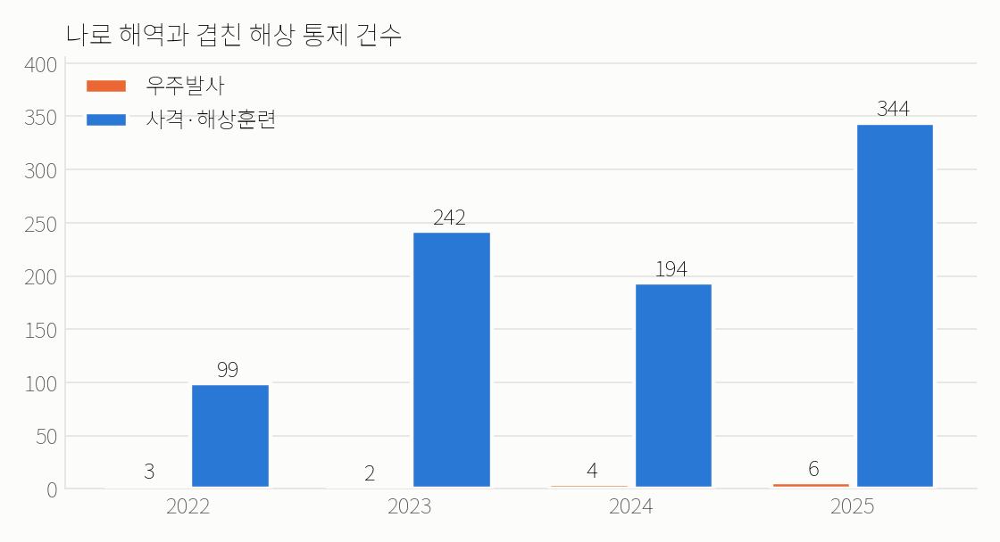
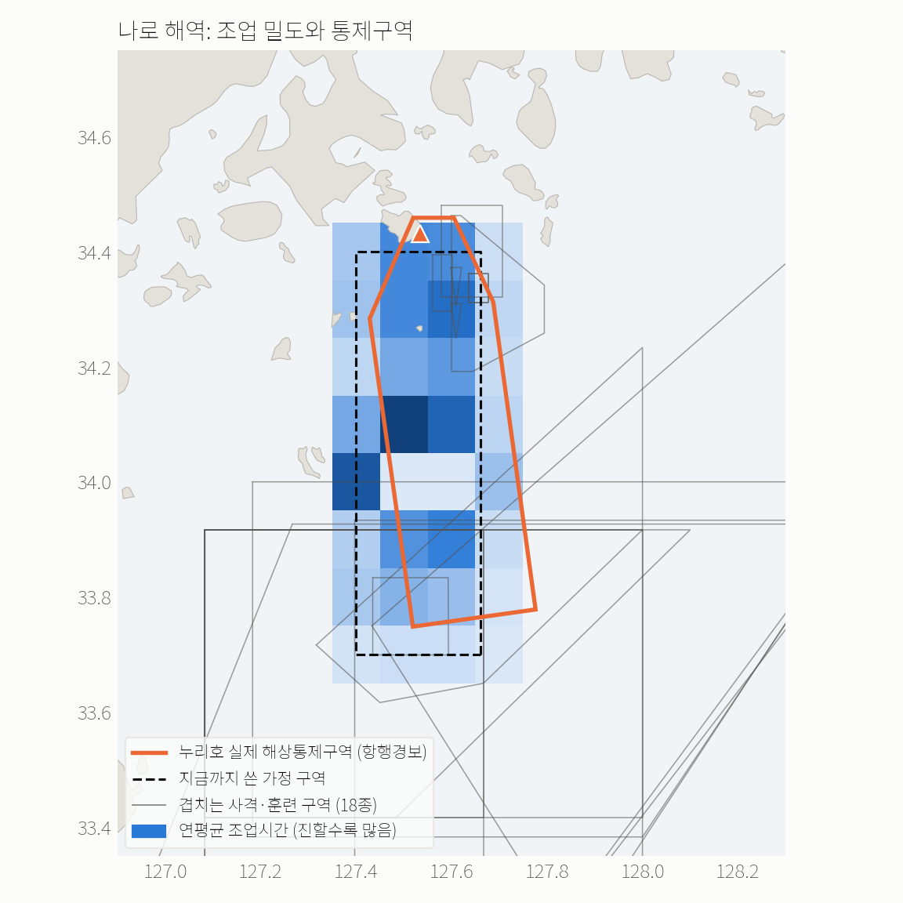

# 블루윈도우 · 1주차 발표 (9/30)

> 로켓 발사부터 사격훈련까지, 바다를 잠시 막아야 할 때 **어업 피해가 가장 작은 선택지**를 위성 데이터로 찾는 서비스
> 2026 스페이스 해커톤 · 부문 2. 위성활용 비즈니스 모델

## 이번 주 요약

| | 한 일 | 결과 |
|:---:|---|---|
| 1 | 주제 확정, 기획서·개발 계획 초안 | 블루윈도우 (위성 선박 데이터 × 로켓 발사 해역) |
| 2 | **위성 데이터로 가능성 확인** | 나로 해역에서 연 12~14만 시간, 약 900척 조업이 위성에 잡힘 |
| 3 | 데모 개발 | 실제 데이터로 작동하는 화면 4개 |
| 4 | 틀린 분석 발견·정정 | 하루 단위로는 발사 영향이 안 보임 → "손실 산정"에서 "영향 비교"로 |
| 5 | **주제 점검 → 범위 확장** | 항행경보 5년치 분석: 같은 바다에서 사격훈련 통제가 발사보다 수십 배 잦음 |

---

## 1. 무엇을 만드나

**문제**

- 2027년 2월부터 우주항공청이 발사장 주변에 **발사안전구역**을 "필요 최소 범위"로 지정해야 한다 (우주개발 진흥법 개정)
- 나로우주센터 민간 활용 가이드라인: **민간 발사기업이 어업 피해 보상** 책임
- 그런데 발사 전에 "어떤 날짜·구역이 어업 피해가 작은지" 비교할 자료가 없다
- 해외도 같은 갈등: 영국 셰틀랜드 발사장은 20개월 넘게 어민 보상 합의 실패

**해결**

위성이 기록한 어선 조업 데이터로, 안전이 이미 확인된 선택지(날짜·통제구역)별 어업 영향을 비교하고 협의용 리포트를 만든다.

**하지 않는 것:** 안전구역 설계, 발사일 결정, 보상액 결정

---

## 2. 가장 먼저 한 일: "위성으로 그 바다가 보이나?"

기획 전체의 전제였는데 아무도 확인하지 않았다. 그래서 **문서보다 데이터를 먼저** 확인했다.

- Global Fishing Watch(GFW) 지도에서 나로우주센터 남쪽 바다를 확인
- 과거 나로호 통제 규모(폭 24km, 길이 75km)를 참고해 **가정 통제구역**(24×78km) 설정
- 2022~2025년 배별·날짜별·칸별 조업 자료 다운로드

| 연도 | 조업 추정시간 | 선박 수 |
|---|---:|---:|
| 2022 | 139,115 | 963 |
| 2023 | 123,356 | 862 |
| 2024 | 116,638 | 961 |
| 2025 | 117,977 | 908 |

→ 4년간 1,568척 중 **1,550척이 한국 어선**. 트롤, 고정자망 등 연안 어업이 고르게 잡힌다. **데이터는 충분하다.**



→ 4년 모두 **2월·7월이 가장 적고 가을이 많다.** 발사 시기에 따라 영향이 달라진다.

---

## 3. 비교 결과

통제 4시간 기준, 통제 중 원래 있었을 조업시간(조업기회):

| 발사 후보일 | 구역 A (기본) | 구역 B (연안 제외) | 구역 C (남쪽 축소) |
|---|---:|---:|---:|
| 2027-02-10 | 21시간 | **12시간** | 21시간 |
| 2027-05-12 | 63시간 | 45시간 | 55시간 |
| 2027-09-15 | 76시간 | 63시간 | 70시간 |

- **시기 효과:** 같은 구역에서 2월 vs 9월 약 **3.5배**
- **구역 효과:** 같은 날 구역 대안에 따라 **17~44%** (B·C는 가정 대안)

계산 방법: 후보일 ±15일에 해당하는 과거 4년 하루 조업시간의 중앙값 × (통제 시간 ÷ 24)
예) 2/10 → 하루 약 128시간 × 4/24 ≈ 21시간

---

## 4. 틀렸던 것과 고친 것

| 처음 주장 | 무엇이 틀렸나 | 고친 결과 |
|---|---|---|
| "누리호 3·4차 발사일에 발사장 쪽 조업이 0이었다" | 비교 기준을 조업 있는 날만으로 계산해 평소 값이 부풀려짐 | 조업 없는 날을 0으로 넣으니 그 해역은 평소에도 대부분 0 → **주장 철회** |
| 4차 발사 날짜 11/27 | 한국시간 새벽 발사라 UTC로는 전날 | 11/26으로 수정 |
| "최대 84% 차이" | 2월 vs 9월 비교라 실제 상황과 안 맞음 | 시기 효과(3.5배)와 구역 효과(17~44%)로 분리 |
| 발사 영향 = 예측 − 실제 | 누리호 발사일(하루 단위)에 뚜렷한 감소가 없음 | 몇 시간짜리 통제가 하루 합계에 묻힘 → **"손실 산정" 대신 "영향 비교"** 로 설계 변경 |

→ 숫자를 어떻게 믿느냐는 질문에 **검증 과정 자체**를 보여 줄 수 있도록 기록을 남긴다.

---

## 5. 주제 점검: 이대로 수상할 수 있나?

스스로 찾은 약점 3가지:

| 약점 | 내용 |
|---|---|
| 문제가 작아 보임 | 발사 1회 영향이 21~76 조업시간 → 금액으로 작을 수 있음 |
| 핵심 증거가 약해짐 | 하루 단위로는 발사 영향이 측정되지 않음 |
| 고객이 적음 | 국내 발사는 1년에 몇 번뿐, 발사일을 고를 폭도 좁음 |

다른 주제(위성 기반 양식장 고수온 보험, SAR 불법조업 탐지)와도 비교했다.
→ **주제는 유지하고, 범위를 "바다를 잠시 막는 모든 통제"로 넓히기로 결정.**
발표에서는 우주발사를 대표 사례로 유지한다.

---

## 6. 새로 찾은 것: 항행경보 5년치 분석

국립해양조사원 **항행경보**에는 사격훈련·발사·해상공사로 바다를 통제할 때의 **구역 좌표와 시간**이 공지된다.
2021~2025년 문서 약 1,500건을 모아 **구역 × 날짜 × 시간대** 37,010건으로 정리했다.



→ 전국에서 해마다 **약 6,900~8,300건**의 해상 통제가 공지된다. 대부분 군 사격훈련이다.



→ 같은 나로 해역에서 우주발사 통제는 연 2~6건, **사격·해상훈련 통제는 연 100~340건**.
어민에게 "바다가 막히는 일"은 대부분 사격훈련이다.



→ **누리호 실제 해상통제구역 좌표**(약 1,719km², 2차 기준 12:00~19:20)도 확보했다. 지금까지 쓴 가정 구역과 위치가 조금 다르다.

**이 발견으로 풀리는 것**

| 약점 | 어떻게 풀리나 |
|---|---|
| 시장이 작다 | 분석 대상이 연 몇 건 → **연 수천 건** |
| 발사가 4건뿐이라 영향 측정이 어렵다 | 같은 바다의 사격 통제 **수백 건**(시각 포함)으로 먼저 측정하고, 누리호 4건으로 검증 |
| 통제구역이 가정값이다 | 누리호 1~4차 **실제 좌표·시각** 확보 |

주의: 항행경보는 **공지 기준**이라 연기돼 실제로 통제하지 않은 날도 섞여 있다.

---

## 7. 데모

Python + Streamlit, 실제 GFW 데이터 사용

| 화면 | 내용 |
|---|---|
| ① 해역 조업 지도 | 바다를 약 9×11km 칸으로 나눈 조업 밀도, 월별·연도별 추이 |
| ② 선택지 비교 | 날짜·구역 대안을 넣으면 예상 영향 순위 |
| ③ 영향근거 리포트 | 영향 배 수, 조업기회, 어구, 자주 오는 어선, 한계, 내려받기 |
| ④ 과거 발사일 확인 | 누리호 발사일 조업 vs 다른 해 같은 시기 |

```bash
streamlit run app/streamlit_app.py
```

---

## 8. 다음 주 할 일

1. 가정 구역 → **실제 누리호 통제구역**으로 교체하고 결과 다시 계산
2. 항행경보 통제마다 **조업기회 계산** → 해역 누적 영향, 통제 달력 화면
3. GFW **시간 단위** 자료 신청·수집 (통제 영향 측정 준비)
4. 금액 대략 추정 (KOSIS 생산금액 ÷ 조업시간), 인터뷰 섭외 (어촌계·발사기업)

---

## 9. 예상 질문

- **그냥 평균 낸 거 아닌가요?** → 지금은 기준선이 맞습니다. 비교 기준을 먼저 세웠고, 날씨 반영 모델은 이 기준선보다 나을 때만 씁니다.
- **발사일은 궤도가 정하는데 2월과 9월 중에 고를 수 있나요?** → 정부 발사는 어렵습니다. 그래서 상황을 나눴습니다. 월 단위 비교는 일정이 유연한 민간 시험 발사용이고, 발사창 안 예비일은 날씨 예측으로 비교합니다.
- **사격훈련까지 넓히면 우주 주제에서 멀어지지 않나요?** → 우주발사가 대표 사례이고 핵심 고객입니다. 사격훈련 자료는 시장을 넓히고, 발사가 4건뿐인 문제를 풀어 주는 **비교 사례**로 씁니다.
- **손실은 왜 계산 안 하나요?** → 하루 단위로는 측정되지 않았고, 어민이 다른 시간·해역으로 옮길 수 있습니다. 시간 단위로 먼저 측정합니다.
- **AIS 없는 작은 배는요?** → 등록 어선 수와 비교해 포착률을 계산하고 SAR 위성으로 검증합니다. 리포트에 한계를 적습니다.
- **발사기업이 돈을 내는데 어민이 믿을까요?** → 계산 방법과 코드를 공개하고, 공동 발주를 기본으로 하며, 금액은 범위로만 냅니다.

---

<sub>자료: Global Fishing Watch public-global-fishing-effort v4.0 · 국립해양조사원 항행경보 (2026-09-28 수집) · Natural Earth. 그림 재현: `python analysis/make_figures_0930.py`</sub>
